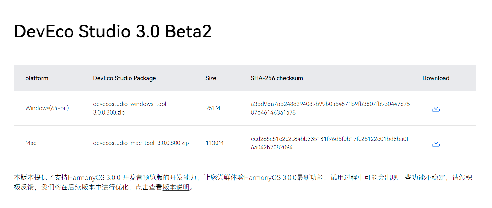
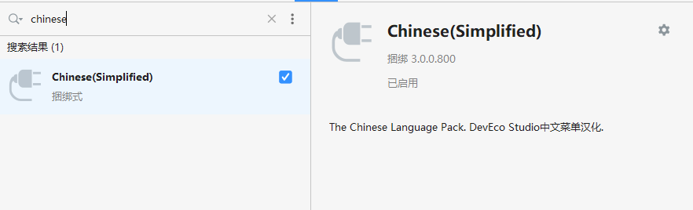
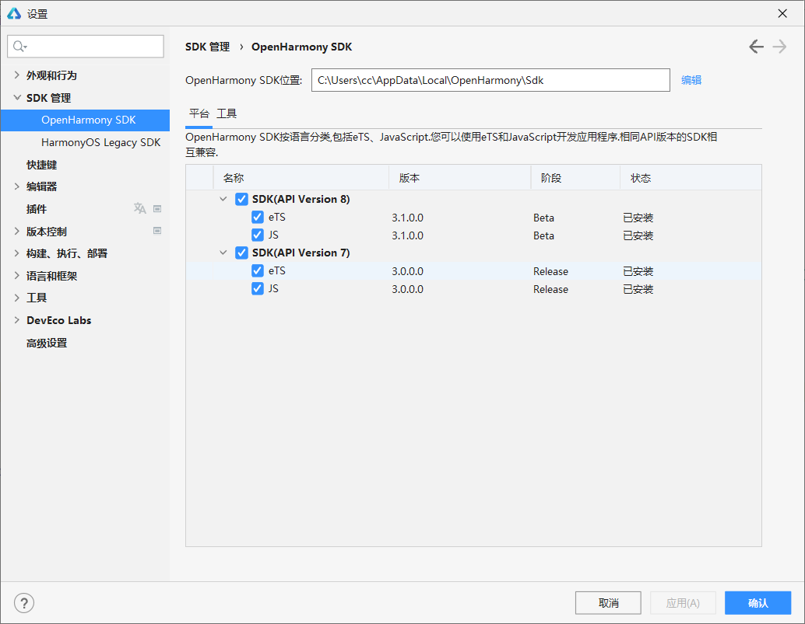
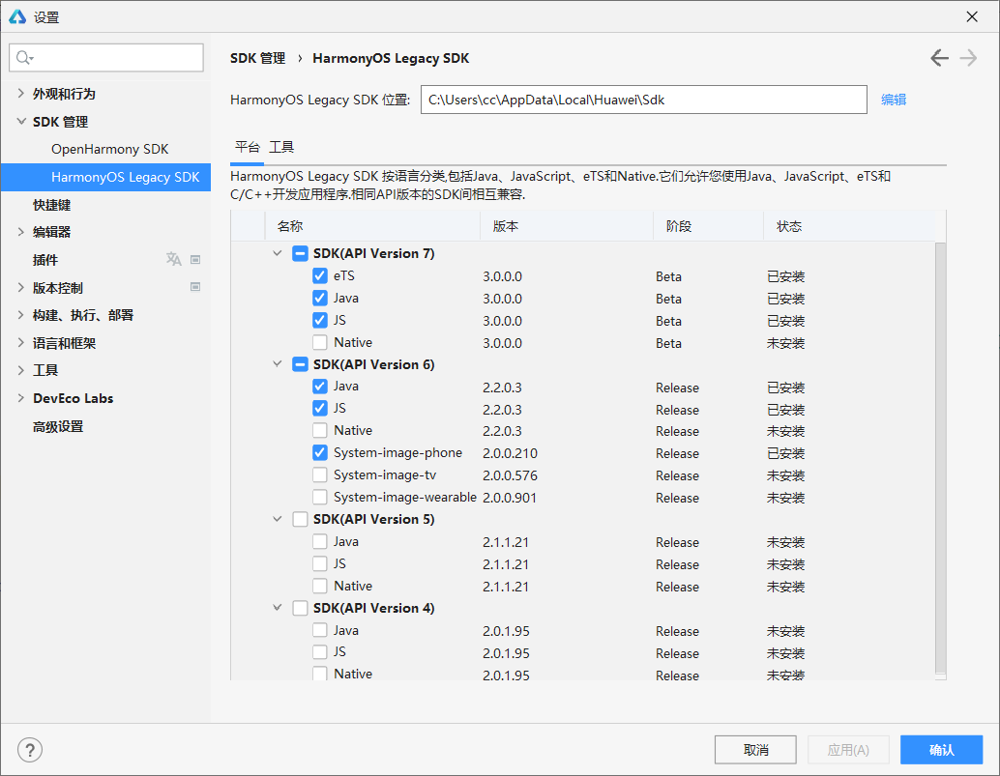
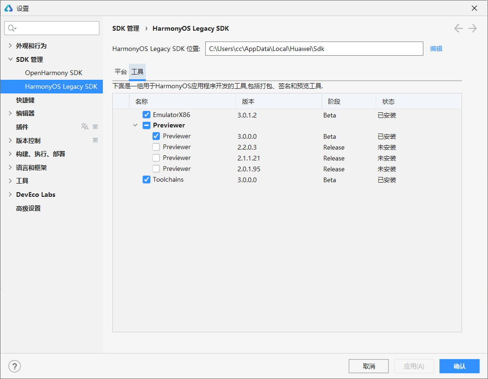

# 02 - 开发环境配置

## IDE 下载与安装

华为 HarmonyOS 开发使用的是 **DevEco Studio**，是基于 IntelliJ IDEA Community 开源版本二次开发，如果之前使用过 Android Studio ，可看出界面几乎没有差别。目前仅支持 Windwos 和 Mac 平台，Linux 平台正在开发中 👉 [下载地址](https://developer.harmonyos.com/cn/develop/deveco-studio#download)

> 随着近期即将发布的 HarmonyOS 3.0 版本，IDE 也同样选择 3.0 版本即可

安装过程按部就班即可。安装完毕后，首次进入 DevEco Studio 会提示下载一系列的 HarmonyOS SDK，根据所需选择即可。

- DevEco Studio 的汉化

默认 DevEco Studio 是英文界面，为方便使用我们可以汉化它，官方也是支持汉化插件的，在主界面点击`File`→`Setting`，弹出设置界面，在左侧菜单栏点击`Plugins`，接着在右侧搜索框输入`Chinese`，最后 ✔ 以下插件，确定并重启 IDE 即可。

## HarmonyOS SDK

默认 DevEco Studio 在安装时会配置 SDK，如果因为网络或其他原因导致安装失败（幸好鸿蒙是国内项目，不然如谷歌 Android，下个 SDK 都痛苦得要死），可以在 DevEco Studio 中再次安装。

在主界面点击点击`Ctrl + Alt +S`键弹出设置界面，在左侧菜单栏点击`SDK管理`，可以看出有 **OpenHarmony SDK** 和 **HarmonyOS Legacy SDK** 两种，前一个为华为开源的鸿蒙基础系统 SDK，而后一个是华为基于 OpenHarmony 开发的商用版本 HarmonyOS SDK，二者关系可以类比 Linux 操作系统中 Fedora 与 RHEL 的关系。

OpenHarmony SDK是应用于开发板、鸿蒙物联网设备等开发（OpenHarmony 仅支持 Javascript SDK 和 eTS SDK）。我们先介绍在华为的鸿蒙手机、平板、可穿戴等设备的开发，则选中 Harmony Legacy SDK，目前 HarmonyOS 3 使用的是**API Version 7**，将该目录下的`eTS`、`JS`都勾选上。，在 HarmonyOS Legacy SDK 中建议勾选 API Version 7、API Version 6，并同时勾选`Java`、`eTS`、`JS`选项。

目前仅有 API Version 6 支持公开的虚拟机镜像，可以针对要开发的设备（如 Phone、Tv、Wearable、Car 等），选中`System-image-X`即可。

接下来点击右侧`工具`选项卡，可以安装用于打包、签名、PC 模拟器等，勾选`EmulatorX86`、`Preview`、`Toolchain`即可

