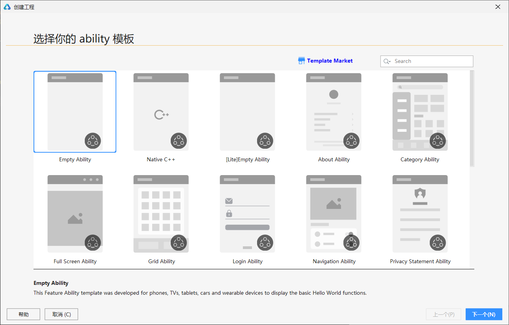

# 03-构建一个Demo项目

## 新建项目

启动DevEco Studio，点击`创建工程`，在弹出界面选择`Empty Ability`

点击Next，进入到工程配置阶段，需要根据向导配置工程的基本信息。

- **Project name**：工程的名称，可以自定义。
- **Project type**：工程的类型，标识该工程是一个原子化服务（Atomic Service）或传统方式的需要安装的应用（Application）。

> 📢说明
>
> 如果是创建的原子化服务，则：
>
> - 原子化服务调试、运行时，在设备桌面上没有应用图标，请使用DevEco Studio的调试和运行功能，来启动原子化服务。
> - 原子化服务是免安装的，config.json中自动添加installationFree字段，取值为“true”。
> - 如果entry模块的installationFree字段为true，则其相关的所有hap模块的installationFree字段都默认为true；如果entry模块的installationFree字段为false，则其相关的所有hap模块可以配置为true或false。
> - 编译构建APP时，每个hap包大小不能超过10MB。

- **Bundle name**：软件包名称，默认情况下，应用/服务ID也会使用该名称，应用/服务发布时，应用/服务ID需要唯一。如果“Project Type”选择了Atomic Service，则Bundle Name的后缀名必须是.hmservice。
- **Save location**：工程文件本地存储路径，请注意，工程存储路径**不能包含中文字符。**
- **Compatible API version**：兼容的SDK最低版本。
- **Language**：该工程模板支持的开发语言，可根据模板支持的语言选择JS或eTS或Java，其中eTS在DeEco Studio V3.0 Beta2及以上版本支持。
- **Development mode**：选择开发模式，部分模板支持低代码开发，可选择Super Visual。
- **Device type**：该工程模板支持的设备类型，支持多选，默认全部勾选。如果勾选多个设备，表示该原子化服务或传统方式的需要安装的应用支持部署在多个设备上。
- **Show in service center**：是否在服务中心露出。如果Project type为Atomic Service，则会同步创建一个2\*2的服务卡片模板，同时还会创建入口卡片；如果Project type为Application，则只会创建一个2\*2的服务卡片模板。
- **Use ArkCompiler**：打开该开关，表示该工程在编译构建时，使用ArkCompiler方舟编译器进行编译。

> 📢说明
>
> - 使用方舟编译器进行编译为实验特性，需要先在File > Settings > DevEco Labs >Ark中，勾选“Enable HarmonyOS Ark”选项，才能选择使用方舟编译器对工程进行编译。
> - 当前仅Phone和Tablet工程支持使用方舟编译器进行编译。
> - 当前JS/eTS原子化服务和HarmonyOS应用/服务工程，以及JS卡片支持使用方舟编译器进行编译。

- **Advanced**：高级选项，根据选项预览该工程模板的效果图。仅部分工程模板支持效果图预览。

## 项目结构