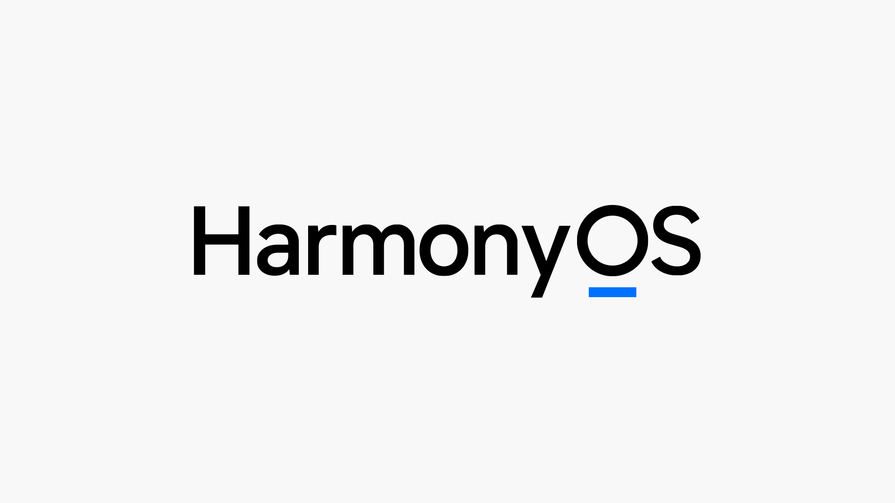

# 华为 HarmonyOS 编程学习笔记

## 使用说明

- 本项目使用[Docsify](https://docsify.js.org/)技术生成，并托管在[GitHub Pages]()和 [Gitee Pages]()

## 课程资源

- [华为开发者中心-HarmonyOS 应用开发系列课](https://developer.huawei.com/consumer/cn/training/study-path/101621309859165043)

## 其他参考学习资源

## 建议&问题反馈

同学们在学习的过程中，如果对笔记上的内容有任何想说的（如 🙋‍♀️**提问&回答**、✒**排版**、💬**意见建议** ）可以在对应的每篇笔记页面的 👇 最底部 👇 的**Gitalk 留言板**畅所欲言（需登录 Github 账号），留言内容将作为项目的 Issues 提交至作者，我们会尽快进行回复反馈。
